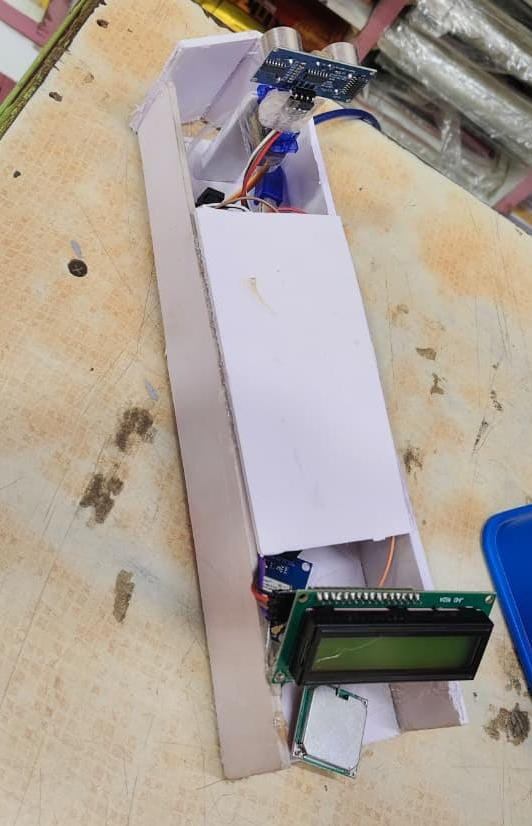
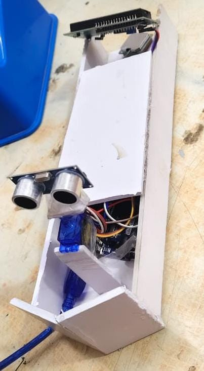

# 🚤 Multi-Purpose Sea Surveillance + Search and Rescue Boat

## 📌 Overview
A low-cost, semi-autonomous surface vehicle designed for real-time 
marine monitoring, obstacle detection, and GPS-based tracking. 
The system integrates embedded control, sensor technology, and 
basic actuation to perform coastal monitoring, flood rescue, and 
environmental surveillance operations.

Developed as part of **Product Development Lab I** at 
RMK College of Engineering and Technology, Chennai (October 2025).

## 📄 Project Report
👉 [View Full Project Report](project-report.pdf)

## 🎥 Demo Video
👉 [Watch Demo Video Here](https://drive.google.com/file/d/1aoiPWfpB7SJ8qD0buN6JK18kUHh0fvqm/view?usp=sharing)

## 📸 Hardware Prototype



## 🛠️ Tech Stack
| Component | Technology |
|---|---|
| Microcontroller | Arduino UNO |
| Obstacle Detection | Ultrasonic Sensor (HC-SR04) |
| 360° Scanning | Servo Motor (SG90) |
| Location Tracking | GPS Module (NEO-6M) |
| Alert System | Passive Buzzer |
| Power Supply | 12V Rechargeable Battery |
| Programming | Arduino IDE (Embedded C) |

## ⚙️ Features
- ✅ 360° obstacle detection using ultrasonic sensor + servo motor
- ✅ Real-time GPS coordinate tracking (latitude & longitude)
- ✅ Instant buzzer alert when obstacle detected within 35-40 cm
- ✅ Continuous environmental scanning via rotating sensor mount
- ✅ Low-cost, lightweight and scalable design
- ✅ Suitable for coastal monitoring, flood rescue and marine surveillance
- ✅ Serial monitor display of real-time GPS location data

## 🔧 Hardware Components
| Component | Purpose |
|---|---|
| Arduino UNO | Central microcontroller — processes all sensor data |
| HC-SR04 Ultrasonic Sensor | Obstacle detection (range: 2cm–400cm) |
| SG90 Servo Motor | 360° rotation for complete environmental scanning |
| NEO-6M GPS Module | Real-time location tracking via satellite |
| Passive Buzzer | Audio alert on obstacle detection |
| 12V Rechargeable Battery | Power supply for all modules |

## 🏗️ System Architecture
```
Arduino UNO (Central Controller)
        ↓
┌───────────────────────────────┐
│  HC-SR04 + Servo Motor        │ → 360° Obstacle Scanning
│  NEO-6M GPS Module            │ → Location Tracking
│  Passive Buzzer               │ → Alert System
│  12V Battery + Voltage Reg.   │ → Power Supply
└───────────────────────────────┘
```

## ⚙️ System Workflow
```
START
  ↓
Initialize all modules 
(Arduino, Servo, GPS, Buzzer, Ultrasonic)
  ↓
Rotate servo motor → scan 360°
  ↓
Read ultrasonic sensor → measure distance
  ↓
Obstacle detected? 
  YES → Trigger buzzer + fetch GPS location
  NO  → Continue scanning
  ↓
Log data → Continue loop
  ↓
END
```

## 📊 Results
| Parameter | Result |
|---|---|
| Obstacle Detection Range | 35–40 cm |
| GPS Accuracy | ±3 meters |
| Servo Rotation | 360° continuous |
| Buzzer Response | Near instantaneous |
| Power Supply | 12V battery — extended operation |

## 🔮 Future Enhancements
- 📷 Camera module for live visual monitoring
- 🌐 IoT integration for cloud-based GPS data transmission
- 🤖 AI-based autonomous navigation algorithms
- ☀️ Solar charging for longer operational duration
- 📡 GSM/LoRa wireless communication modules

## 👥 Team Members
- **Abenayaa B** (111624104001) — System Integration & Documentation
- **Hanis Mariam A** (111624104028) — Hardware Assembly & Circuit Design
- **Jashiraa Shabrein S** (111624104037) — Embedded Programming & Testing

## 🏆 Achievement
Developed as part of **Product Development Lab I (24EC311)**
RMK College of Engineering and Technology
RSM Nagar, Puduvoyal — 601206 | October 2025

Supervised by: **Dr. V Dyana ChristiIda**
Department of Electronics and Communication Engineering

## 📞 Contact
**Abenayaa B** — 3rd Year ECE Student, RMKCET Chennai

[](https://linkedin.com/in/abenayaaB)
[](https://github.com/abenayaaB)
[](https://leetcode.com/u/abenayaaB)

## 🔗 Related Project
**Women Safety Purse** — IoT-based safety system with Android app
👉 [View Project](https://github.com/abenayaaB/women-safety-purse)
